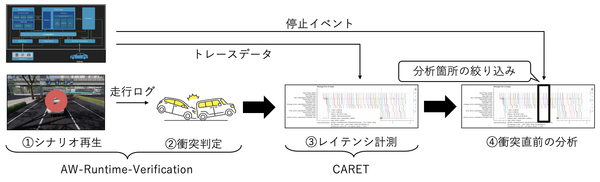

# ALB-Framework(Autoware Latency–Behavior Integrated Evaluation Framework)

## 概要

ALB-Framework は，[Autoware](https://autoware.org/)の 内部処理遅延（internal execution latency） と 走行挙動（driving behavior） の関連性を評価するためのフレームワークです．

本フレームワークでは，以下の既存ツールを組み合わせて使用します．

- [CARET: (Chain-Aware ROS Evaluation Tool)](https://github.com/tier4/caret)

  Autoware 内のコールバック処理や DDS 通信レイテンシをトレースする内部計測ツール  

- [AW-Runtime-Verification](https://github.com/duongtd23/AW-Runtime-Verification)

  シミュレーションシナリオを生成し，走行挙動や安全性を評価する検証ツール

- [AWSIM-Labs](https://github.com/duongtd23/AWSIM-Labs)

  Autoware と連携可能なシミュレーション環境で，様々な走行シナリオを実行可能



## セットアップ方法

1. ALB-Frameworkのクローン

    ```bash
    $ git clone https://github.com/akiyama-lab/alb-framework.git
    $ cd alb-framework
    $ git submodule update --init --recursive
    ```

2. Autowareのソースコードの取得

    [Autoware Source Installation](https://autowarefoundation.github.io/autoware-documentation/main/installation/autoware/source-installation/) に従って進めます．
    ワークツリーとして追加したディレクトリに移動し，ソースコードを取得します．

    ```bash
    $ cd autoware
    $ ./setup-dev-env.sh
    $ mkdir src
    $ vcs import src < autoware.repos
    ```

    複数バージョンの Autoware で計測する場合には，ワークツリーを利用して別ディレクトリにソースコードを取得します．
    以下は Autoware 1.5.0 をワークツリーとして追加する例です．

    ```bash
    $ cd autoware
    $ git worktree add ../autoware-1.5.0 1.5.0
    $ cd ../autoware-1.5.0
    $ ./setup-dev-env.sh
    $ mkdir src
    $ vcs import src < autoware.repos
    ```

3. CARETのセットアップ

    [CARET Installation](https://tier4.github.io/caret_doc/latest/installation/installation/) に従い，CARETをインストールします．
    [caret#217](https://github.com/tier4/caret/issues/217) にあるように，agnocast パッケージのトレースポイントを追加するために，[agnocast ブランチ](https://github.com/tier4/caret/tree/agnocast)を指定しています．

    ```bash
    $ cd caret
    $ mkdir src
    $ vcs import src < caret.repos
    $ ./setup_caret.sh
    $ source /opt/ros/humble/setup.bash
    $ colcon build --symlink-install --cmake-args -DCMAKE_BUILD_TYPE=Release
    $ source ~/alb-framework/caret/install/local_setup.bash
    $ ros2 run tracetools status # return Tracing enabled
    ```

4. Autowareのビルド

    libtracetools.so の競合を避けるために，pcl_ros パッケージの export_pcl_rosExport.cmake ファイルを修正した後，Autoware のビルドを行います．
    [caret known issues](https://tier4.github.io/caret_doc/main/faq/known_issues/#build)に記載されている手順に従います．

    ```bash
    $ cd autoware-1.5.0
    $ source ~/alb-framework/caret/install/local_setup.bash
    $ sudo cp /opt/ros/humble/share/pcl_ros/cmake/export_pcl_rosExport.cmake /opt/ros/humble/share/pcl_ros/cmake/export_pcl_rosExport.cmake.bak
    $ sudo sed -i -e 's/\/opt\/ros\/humble\/lib\/libtracetools.so;//g' /opt/ros/humble/share/pcl_ros/cmake/export_pcl_rosExport.cmake
    $ colcon build --symlink-install --cmake-args -DCMAKE_BUILD_TYPE=Release -DBUILD_TESTING=Off -DCMAKE_CXX_FLAGS="-w"
    $ ros2 caret check_caret_rclcpp ./
    ```

5. AWSIM Labsのビルド

    [AWSIM-Labs](./AWSIM-Labs/)のビルドを行います．
    [Setup Unity Project](https://autowarefoundation.github.io/AWSIM-Labs/main/GettingStarted/SetupUnityProject/)に記載されている手順に従い，Unityでプロジェクトを立ち上げ，ビルドを行います．

6. Autowareのパラメータ変更

    [dtanony/autoware0412](https://github.com/dtanony/autoware0412) を参考にして，`{autoware-repo}/src/launcher/autoware_launch/autoware_launch/config/planning/scenario_planning/common/common.param.yaml` を変更します．

    ```yaml
    /**:
      ros__parameters:
        max_vel: 16.667           # max velocity limit [m/s]

        # constraints param for normal driving
        normal:
          min_acc: -6.5         # min deceleration [m/ss]
          max_acc: 6.0          # max acceleration [m/ss]
          min_jerk: -13.0       # min jerk [m/sss]
          max_jerk: 13.0         # max jerk [m/sss]

        # constraints to be observed
        limit:
          min_acc: -8.33        # min deceleration limit [m/ss]
          max_acc: 5.0          # max acceleration limit [m/ss]
          min_jerk: -83.33      # min jerk limit [m/sss]
          max_jerk: 5.0         # max jerk limit [m/sss]
    ```

## トレース

ターミナルを4つ開き，以下の手順でトレースを行います．
ここでは，Autoware 1.5.0 を使用する例を示します．

1. Autowareの起動

    CARETで無視するトピックやノードを設定し，Autowareを起動します．

    ```bash
    $ source ~/alb-framework/caret/setenv_caret.bash
    $ source ~/alb-framework/autoware-1.5.0/install/local_setup.bash
    $ ros2 launch autoware_launch e2e_simulator.launch.xml vehicle_model:=awsim_labs_vehicle sensor_model:=awsim_labs_sensor_kit map_path:=/home/akilab/autoware_map/nishishinjuku_autoware_map launch_vehicle_interface:=true
    ```

2. AWSIM Labsの実行
    AWSIM Labsの実行ファイルを起動します．
    `-script`でシナリオスクリプトを指定し，`-output`でトレースデータの出力先を指定します．
    自車両が表示され，Autowareで自己位置が認識されるまで待ちます．

    ```bash
    $ cd ~/alb-framework/AWSIM-Labs
    $ ./awsim_labs.x86_64 -script ../AW-Runtime-Verification/AWSIM-Script/cutin/cutin20-10-6.script -output ../output/AW-runtime-Verification/Traces
    ```

3. CARETでトレース

    Autowareの動作中に，CARETでトレースを開始します．

    ```bash
    $ source ~/alb-framework/caret/install/local_setup.bash
    $ export ROS_TRACE_DIR=~/alb-framework/output/caret_trace_data
    $ ros2 caret record -s cutin-20-10-6
    ```

4. Autowareの停止イベントの取得

    Autowareの停止などのイベントを取得するために，[`tools/autoware_event_capture.py](./tools/autoware_event_capture.py) を実行します．
    停止イベントの時間は分析で使用します．

    ```bash
    $ python3 ./tools/autoware_event_capture.py | tee output/topic/aw-runtime-verification/cutin30-20-1.yaml
    ```

5. AWSIM Labsのシナリオを再開

    AWSIM Labsは，初期位置に自車両を配置した後，シナリオが一時停止状態になります．
    シナリオを再開するために，以下のコマンドを実行します．

    ```bash
    $ ros2 topic pub --once /awsim/set_goal_trigger std_msgs/msg/Bool "{data: true}"
    ```

5. トレースの停止

    シナリオが終了したら，CARETでトレースを停止します．

## 分析

1. AW-Checkerによる走行挙動の評価

    AW-Runtime-VerificationのAW-Checkerを使用して，AWSIM Labsでの走行挙動を評価します．
    以下のコマンドで，シナリオスクリプトとトレースデータを指定して評価を実行します．

    ```bash
    $ cd ~/alb-framework/AW-Runtime-Verification
    $ maude AW-Checker/propositions.maude
    Maude> load ../output/aw-runtime-verification/Traces/lidar/cutin/cutin20-10-1.maude .
    Maude> load AW-Checker/metacom.maude .
    Maude> load ../output/aw-runtime-verification/Traces/lidar/cutin/properties-checking.maude .
    ```

2. 時間窓の指定

    `tools/autoware_event_capture.py` で取得した停止イベントの時間をもとに，分析する時間窓を指定します．
    停止イベントは，トレースフェーズで出力されるYAMLファイルで確認できます．[tools/autoware_event_capture.py](./tools/extract_topic_timestamps.py) を使うとより簡単にイベントの時間を抽出できます．

    これらの時間を `run.sh` で `start_ns` と `end_ns` の環境変数を設定することで，特定の時間窓に基づいて分析を行うことができます．
    例えば，停止イベントが 1234567890123456789 ナノ秒のタイムスタンプを持つ場合，以下のように時間窓を指定します．

    ```bash
    export START_NS=1234567890123456789
    export END_NS=1234567890123456789
    ```

    `message_flow_trigger` と `message_flow_margin_s` の環境変数を設定することで，停止イベントの前後に一定の時間を追加して分析することもできます．
    例えば，停止イベントの前後に3秒を切り出す場合，以下のように時間窓を指定します．

    ```bash
    export message_flow_trigger=1234567890123456789
    export message_flow_margin_s=3
    ```

3. caret_reportによる内部処理遅延の分析

    caret_reportを使用して，Autowareの内部処理遅延を分析します．
    以下のコマンドで，トレースデータを指定して分析を実行します．

    ```bash
    $ cd ~/alb-framework/output/caret_report
    $ ./run.sh ../caret_trace_data/lidar-only/cutin-20-10-6
    ```

参考までに，レポートは <https://akiyama-lab.github.io/alb-framework/> で公開しています．
